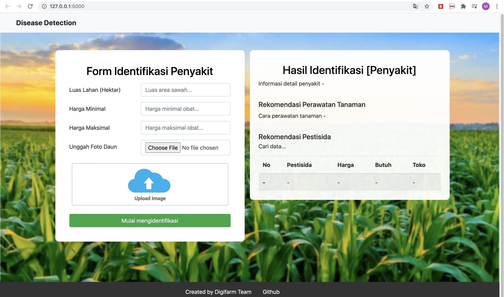
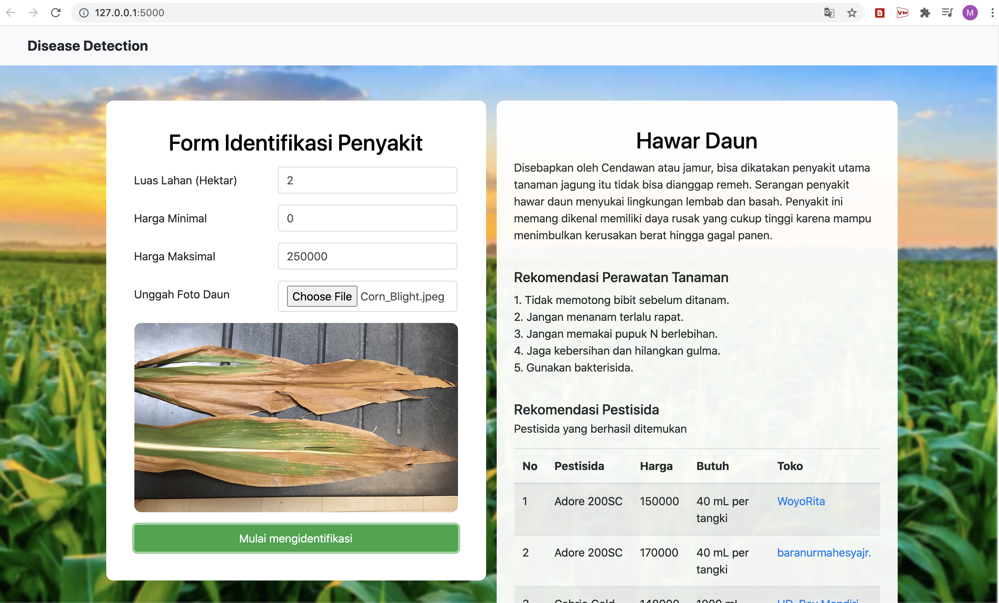

# Disease Identification

Disease Identification is end-to-end image classification project that allow user to identify a disease in a plant leaf by giving the leaf image to the system. The System will identify the disease using ResNet50 model where the model accuracy reaches 86.12% (we do model training for maize and rice leaves). After the system get the disease, the result will be used to perform a query select on the data to get treatment and pesticide recommendations for the plant. For pesticide recommendation, farmer can select and compare with pesticide is easier to get at a lower price. We hope that this project can help Indonesian farmers in caring for crops. <b><i>This is just MVP product</i></b>, feel free to develop for feature improvement.

**Project Overview**

 

### Let's Get Started
If you want to try this project to your local system, just follow this step (I assume, you have installed PyCharm in your PC):
<ol>
  <li>Clone this project to your local PC.</li>
  <li>Open your terminal and go to the project folder. Start to install requirements python library using this command:  <i><b>pip install -r requirements.txt</b></i>
  <li>Build model ResNet50 in folder MODEL > plant_diseases_identification.ipynb using jupyter notebook or google colab. To make it faster, just download our ready model <a href="https://drive.google.com/file/d/1m-SPJFvq9GnmJoaF4BKREq1mUe9RNQOg/view?usp=sharing">ResNet50 Model here</a>.</li>
  <li>Put the model you have downloaded to Disease-Identification folder (at the same folder with main.py)</li>
  <li>Open Pycharm and load your project, make sure you use a correct interpreter (requirements library already installed). If there is an error because of library not found, you can install it by your own using: <i><b>pip install library_name</b></i></li>
  <li>Run the main.py file and wait a minutes (2-5 minutes to load the model)</li>
  <li>If successful, you will get an IP http://127.0.0.1:5000/ to load your webpage.</li>
</ol>

**Project Output**

 
🎉 Congrats... Now, you can start to try our project. Feel free to do feature improvements and just contact me if you get any problems. Happy coding guys :)
